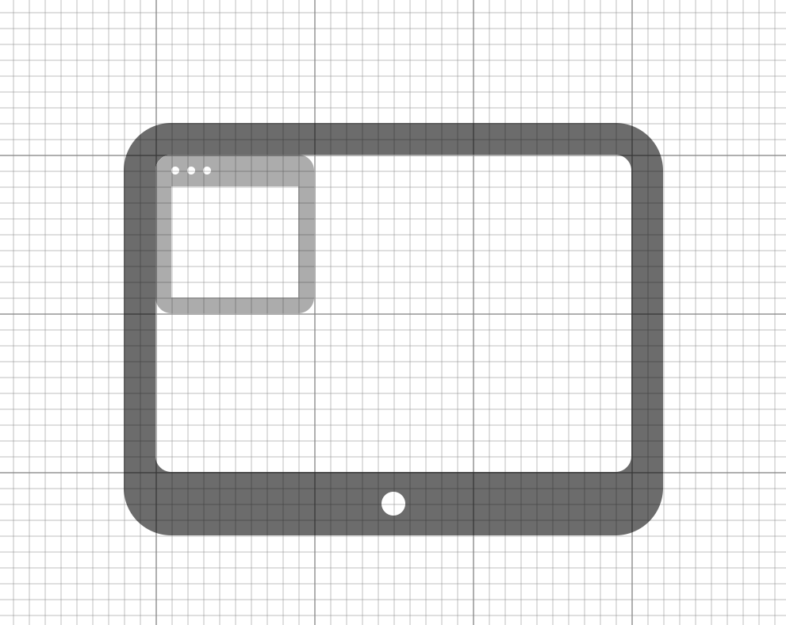

# Artboard

Artboard is a simple way to add a checkered grid to any HTML element with CSS or SCSS. The intended use case is to provide a grid for creating art assets in HTML, CSS and JavaScript.



## Inspiration

The approach of using a gradient as a background is borrowed from [this ingenious hack](http://stackoverflow.com/questions/4191260/drawing-a-grid-using-css/28344125#28344125) from [user3061127](http://stackoverflow.com/users/3061127/user3061127) on Stack Overflow.

## Installation

    npm install artboard

## Usage

## Basic

To add a simple `10x10` grid with divider lines after every ten grid lines, just import the CSS:

``` html
<link rel="stylesheet" href="[path to artboard]/dist/artboard.css">
```

And give a tag the `artboard-grid` class:

``` html
<body class="artboard-grid">
```

### Overlay

To add a transparent overlay to the whole HTML document, just add a `div` with the `artboard-overlay` class:

``` html
<div class="artboard-overlay"></div>
```

## Custom

The grid can be compiled with custom values by importing `artboard` into an SCSS file:

``` css
@import '[path to artboard]/artboard';
```

A custom grid can be constructed by setting these variables:

``` css
/* Space between grid lines */
$artboard-grid-px: 10px;
/* Color of grid lines */
$artboard-grid-color: rgba(0, 0, 0, .25);
/* Number of grid lines between divider lines */
$artboard-divider-interval: 10;
/* Color of divider lines */
$artboard-divider-color: rgba(0, 0, 0, .5);

/* Note that the above variables must be set before importing artboard */
@import '[path to artboard]/artboard';
```

The grid can be then be included using a CSS style:

``` html
<body class="artboard-grid">
```

A SCSS mixin:

``` css
body {
  @include artboard-grid();
}
```

Or an SCSS `@mixin` with custom values:

``` css
body {
  /* @mixin artboard-grid($grid-px: $artboard-grid-px, $grid-color: $artboard-grid-color, $divider-interval: $artboard-divider-interval, $divider-color: $artboard-divider-color) { */
  @include artboard-grid(10px, rgba(0, 0, 0, .25), 10, rgba(0, 0, 0, .5));
}
```

### Overlay

The artboard overlay's opacity can also be changed with a variable:

``` css
$artboard-overlay-opacity: .5;

/* Note that the above variable must be set before importing artboard */
@import '[path to artboard]/artboard';
```

Or included with a `@mixin`:

``` css
.grid {
  /* @mixin artboard-overlay($opacity: $artboard-overlay-opacity, $grid-px: $artboard-grid-px, $grid-color: $artboard-grid-color, $divider-interval: $artboard-divider-interval, $divider-color: $artboard-divider-color) { */
  @include artboard-overlay(.2);
}
```

## Example

One advantage to creating assets in HTML, CSS and JavaScript is that scalable graphics can be created alongside animation logic that also scales. In the included example, animated HTML elements are positioned on the grid; changing the grid size also changes the positions of all these elements, as well as the animation, while everything continues to remain in scale.


